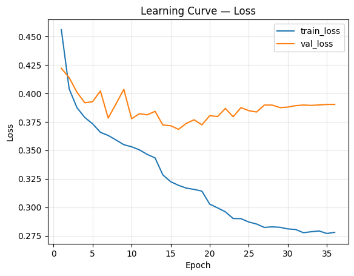
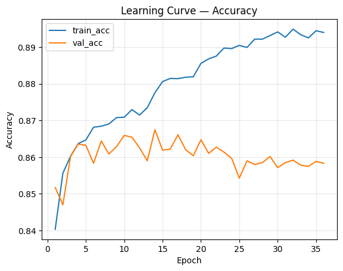
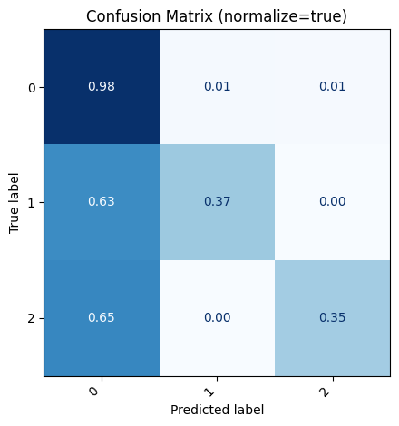
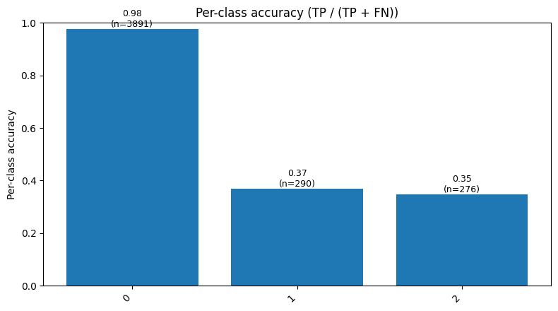

# Pong Transformer

This repository contains a complete research-oriented pipeline for **learning paddle control in Atari Pong using Transformer architectures**.  
It includes **game recording**, **data extraction and preprocessing**, and **deep learning training** using PyTorch.

---

## Game Recording and Data Extraction

### Overview

The project starts from raw gameplay using **OpenAI Gym’s Atari Pong environment**, where human or scripted input is captured frame-by-frame through a custom interface (`play_pong.py` and `GUI.py`).  
Each frame, action, and reward are logged and stored for later feature extraction.

### Pipeline Stages

1. **Game Recording (`play_pong.py`)**  
   - Launches a custom Tkinter-based Pong interface.  
   - Captures each frame from the Gym environment and the corresponding player action (`UP`, `DOWN`, or `NOOP`).  
   - Saves RGB frames as `.npy` and animated `.gif` files.  
   - Logs each step (action, reward, scores) in `pong_log.csv`.

2. **Feature Extraction (`extract_all_features.py` / `extract_single_game.py`)**  
   - Parses recorded frames and isolates visual elements by color segmentation.  
   - Detects and computes coordinates for:
     - The **right paddle** (green)
     - The **left paddle** (orange)
     - The **ball** (white)
   - Stores extracted coordinates in a structured dataset (`pong_data_features.csv`).

   Example extracted features include:
   ```text
   ball_x, ball_y, right_paddle_y, left_paddle_y, step, action, reward
   ```

3. **Preprocessing (`preprocessing.py`)**  
   - Cleans raw data, removes invalid frames, and engineers velocity, distance, and angular features.  
   - Generates intermediate files like `pong_data_features_preprocessed.csv`.

4. **Normalization (`normalize_data.py`)**  
   - Standardizes and normalizes all numerical features (Z-score and Min-Max).  
   - Produces the final `pong_data_features_preprocessed_normalized.csv` dataset used for model training.

5. **Data Validation (`test_dataset.py`)**  
   - Automatically validates the dataset integrity:  
     - No missing values  
     - All normalized features within [0, 1]  
     - All action classes represented

### Visual Examples

Below are placeholders for visual examples of feature extraction from recorded gameplay:

- **Right Paddle Detection**
  

- **Left Paddle Detection**
  

- **Ball Tracking**
  

---

## Model Architecture

The **Pong Transformer** uses a Transformer Encoder to learn temporal dependencies across game sequences.  
It predicts the **next action** given the previous 10 frames of game state.

**Core design:**
- Linear projection from feature space → Transformer embedding
- Learnable positional embeddings
- Multi-head self-attention layers
- Classification head (MLP)

```python
class PongTransformer(nn.Module):
    # (batch, seq_len, input_dim) → (batch, num_classes)
```

---

## Training Pipeline

The training script (`main.py`) handles everything automatically:

1. Loads all preprocessed normalized CSVs.
2. Splits them into train/validation/test groups.
3. Builds sequential datasets with sliding windows.
4. Trains the model using AdamW optimizer and early stopping.
5. Logs all metrics to `/logs/train_log.jsonl` and saves checkpoints.

### Outputs
- **Best model** → `/checkpoints/pong_transformer_best.pt`
- **Predictions** → `/logs/test_predictions.json`
- **Per-class mapping** → `/logs/label_map.json`
- **Final metrics** → `/logs/metrics_final.json`

---

## Visualization and Results

Use `notebook.ipynb` to explore the training outcomes.

### Example visualizations:
- Training/validation accuracy and loss curves  
  
  

- Confusion matrix for test predictions  
  

- Per-class accuracy plot  
  

---

## Future Directions

While the current pipeline trains the model **offline**, future extensions will allow **real-time play**, where the trained Transformer acts as a live Pong agent.  
Next milestones include:

- Integration of the model into a **real-time inference loop**.  
- Reinforcement fine-tuning for adaptive play.  
- Visual comparison between **human vs Transformer** behavior.

---

## Repository Structure

```
.
├── GUI.py                          # User interface for managing games and training
├── play_pong.py                    # Game capture and logging
├── extract_all_features.py         # Batch extraction of ball/paddle coordinates
├── preprocessing.py                # Data cleaning and feature engineering
├── normalize_data.py               # Feature normalization
├── test_dataset.py                 # Data integrity tests
├── main.py                         # Transformer training pipeline
├── transformer.py                  # Transformer model definition
├── notebook.ipynb                  # Visualization and metrics
├── data/                           # Game data folders (game_data_*/)
├── checkpoints/                    # Saved model checkpoints
└── logs/                           # Training logs and test predictions
```

---

## License

Released under the **MIT License**.

---

##  Author

*Author: Mattia Bortolaso, Jiashuo Cheng, Emanuele Girardello and Francesco Malfer – 2025*  
*Project: Pong Transformer – Real-Time Temporal Decision Modeling*
