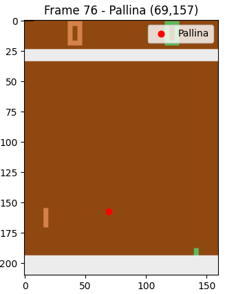
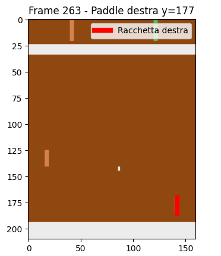
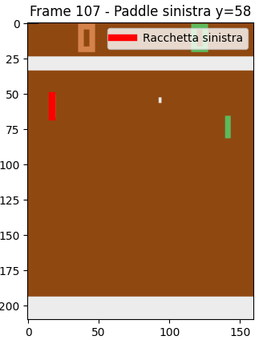

# 🏓 Pong Atari - Guida Passo Passo

Questa guida ti permette di **giocare a Pong** con la tastiera, vedere la partita, e salvare **automaticamente i dati** (CSV) e la GIF della partita.
*Non serve nessuna grafica avanzata: funziona su Windows, Ubuntu e WSL2 (vedi casi speciali sotto).*

---

## 1. Requisiti di base

* **Python** (consigliato 3.10 o 3.12)
  Se non ce l’hai, scaricalo da [python.org](https://www.python.org/downloads/) oppure con il tuo gestore pacchetti (`sudo apt install python3 python3-pip` su Ubuntu)
* **pip** (gestore pacchetti Python)
* Un terminale (Command Prompt, PowerShell, Terminale Ubuntu, ecc.)

---

## 2. Installa Python (se non ce l’hai già)

### Su **Windows**

Scarica Python da [https://www.python.org/downloads/](https://www.python.org/downloads/)
Durante l’installazione, **spunta la casella “Add Python to PATH”**!

### Su **Ubuntu / WSL2**

```bash
sudo apt update
sudo apt install python3 python3-pip python3-venv
```

---

## 3. Crea e attiva un ambiente virtuale (consigliato)

Apri il terminale nella cartella dove hai `play_pong.py`:

```bash
python3 -m venv venv

# Su Windows:
venv\Scripts\activate

# Su Ubuntu/Mac/WSL:
source venv/bin/activate
```

---

## 4. Installa le librerie necessarie

Assicurati che l’ambiente virtuale sia attivo (vedi `(venv)` all’inizio della riga):

```bash
pip install gymnasium[atari,accept-rom-license]
pip install ale-py matplotlib pandas imageio pillow
```

---

## 5. Scarica le ROM di Atari

**Obbligatorio!**

```bash
pip install AutoROM
AutoROM --accept-license
```

Se `AutoROM` non viene trovato, prova:

```bash
python -m AutoROM --accept-license
```

---

## 6. Avvia il gioco

Nella cartella dove si trova `play_pong.py`:

```bash
python play_pong.py
```

---

## 7. Comandi di gioco

* Premi **W** = muovi la racchetta SU
* Premi **S** = muovi la racchetta GIÙ
* Nessun tasto = racchetta ferma
* **Chiudi la finestra** per terminare la partita, salvare il file CSV e la GIF

---

## 8. Output

* **pong\_log.csv** → contiene tutti i dati della partita (step, azioni, reward, score)
* **pong\_run.gif** → animazione della partita che hai giocato

Entrambi i file sono creati nella stessa cartella di `play_pong.py`.

---

## 9. Problemi frequenti e soluzioni

* **Errore: `ModuleNotFoundError: ...`**
  Non hai installato tutte le librerie. Ricontrolla di aver attivato il venv e lanciato tutti i `pip install` sopra.
* **Errore: `AutoROM` non viene trovato**
  Installa con `pip install AutoROM`, oppure usa `python -m AutoROM --accept-license`
* **Il gioco non si avvia / Schermata nera**

  * Su alcune versioni WSL o Linux può essere necessario avviare un server X11/GUI (es: VcXsrv su Windows), ma la versione Tkinter di solito funziona **anche senza grafica avanzata**.
  * Se hai problemi di visualizzazione, assicurati che sia tutto aggiornato (`pip install --upgrade pip` e aggiorna le librerie).
* **Errore: ROM non trovata**
  Rilancia `AutoROM --accept-license` dopo aver installato `ale-py`.

---

## 10. FAQ

**Posso usare Python senza venv?**
Sì, ma è sconsigliato: rischi conflitti tra pacchetti.

**Posso cambiare i tasti di gioco?**
Modifica il dizionario `KEY_ACTIONS` in `play_pong.py`.

**Come vedo i dati?**
Apri `pong_log.csv` con Excel, LibreOffice o pandas.

---

## 11. Estrazione automatica della posizione di pallina e racchette

Dopo aver registrato una partita, puoi estrarre automaticamente le posizioni della pallina e delle racchette frame per frame, e salvarle nel file finale `pong_data_features.csv`.

---

### a. Estrazione della posizione della pallina

Per estrarre la posizione X e Y della pallina in ogni frame:

```bash
python ball_extraction.py
```

Questo script:

* Analizza ogni frame e trova la pallina bianca
* Aggiunge al CSV le colonne `ball_x` e `ball_y`
* Visualizza ogni frame mostrando la posizione trovata con un punto rosso sulla pallina

**Esempio di risultato visualizzato:**

<p align="center">
  
</p>

---

### b. Estrazione della posizione delle racchette

Per tracciare la racchetta del player (destra, verde):

```bash
python player_extraction.py
```

Per tracciare la racchetta dell’opponent (sinistra, arancione):

```bash
python opponent_extraction.py
```

Questi script:

* Analizzano la zona dei bordi dove appaiono le racchette
* Aggiungono al CSV le colonne `right_paddle_y` (player) e `left_paddle_y` (opponent)
* Mostrano la posizione stimata come una barra verticale rossa sulla racchetta

**Esempio di risultato visualizzato:**

|  |  |
| :---------------------------: | :-------------------------------: |
|             Player            |              Opponent             |

---

> ⚠️ **Nota**: Puoi lanciare questi script in qualsiasi ordine!
> Ciascuno aggiornerà il CSV aggiungendo solo la propria colonna, senza cancellare le altre.
> Puoi così ottenere facilmente un dataset pronto per l’addestramento di modelli di predizione.

---

## 12. File finale

Dopo aver eseguito gli script, il file `pong_data_features.csv` conterrà:

* Dati di gioco originali (step, azioni, reward, punteggio…)
* Colonne aggiunte: `ball_x`, `ball_y`, `right_paddle_y`, `left_paddle_y`

---

## 13. Preprocessing dei dati per il training (`preprocessing.py`)

Dopo aver estratto tutte le feature dal gioco, puoi preparare il dataset per l’addestramento della rete neurale tramite lo script `preprocessing.py`.

### Cosa fa lo script di preprocessing

1. **Caricamento dati**

   * Carica il file CSV originale (`pong_data_features.csv`) con tutte le feature estratte da partite di Pong.

2. **Creazione del target (`action_next`)**

   * Crea una nuova colonna `action_next` che rappresenta l’azione che dovrà essere predetta dal modello, cioè quella eseguita nel frame successivo.
   * Questo si ottiene con uno shift di una riga verso l’alto della colonna `action`.

3. **Feature engineering**

   * Calcola nuove feature utili al modello:

     * **Velocità della pallina**: `ball_vx`, `ball_vy` (differenza delle coordinate della palla tra frame consecutivi)
     * **Velocità dei paddle**: `right_paddle_vy`, `left_paddle_vy` (differenza delle coordinate verticali tra frame)
   * Queste feature aiutano la rete a comprendere la dinamica del gioco e non solo lo stato statico.

4. **Pulizia dati**

   * Elimina le righe con valori NaN, generate da shift e differenze (prime/ultime righe).

5. **Scelta delle feature di input**

   * Definisce le colonne di input per la rete neurale, ad esempio:

     * `ball_x`, `ball_y`, `right_paddle_y`, `left_paddle_y`, `ball_vx`, `ball_vy`, `right_paddle_vy`, `left_paddle_vy`
   * Il target sarà `action_next`.

6. **Salvataggio**

   * Il dataset preprocessato viene salvato come nuovo CSV (`pong_data_features_preprocessed.csv`) nella stessa cartella.

### Perché questi passaggi

* **Target corretto:** serve fornire la mossa successiva come target, per insegnare al modello a predire l’azione giusta.
* **Feature dinamiche:** le informazioni sulle velocità rendono la rete capace di imparare strategie di movimento, non solo stati fissi.
* **Dati puliti:** rimuovere i NaN evita errori in fase di addestramento.
* **Dataset pronto:** avere già tutte le feature calcolate velocizza i passaggi successivi come train/test split e normalizzazione.

### Passi successivi (non inclusi nello script)

* Split in train/test
* Normalizzazione delle feature (se non già fatto)
* Preparazione del dataloader PyTorch
* Eventuale aggiunta di altre feature derivate

---

## 📧 Supporto

Per qualsiasi problema:

1. Ricontrolla questa guida.
2. Se l’errore non è qui, copia l’errore e chiedi a chi ha condiviso il progetto.

---

*A cura di Mattia Bortolaso, Emanuele Girardello, Jiashuo Cheng, Francesco Malfer*

📧 Supporto

Per qualsiasi problema:

1. Ricontrolla questa guida.
2. Se l’errore non è qui, copia l’errore e chiedi a chi ha condiviso il progetto.

---

*A cura di Mattia Bortolaso, Emanuele Girardello, Jiashuo Cheng e Francesco Malfer.*
